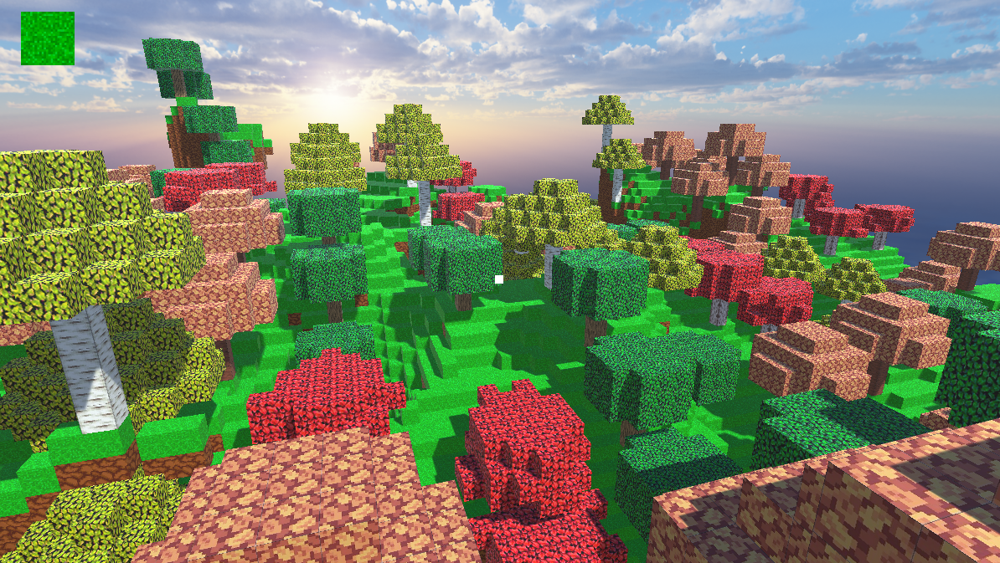
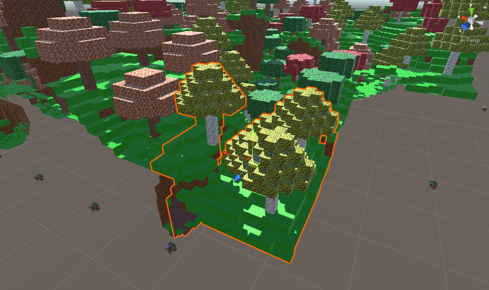
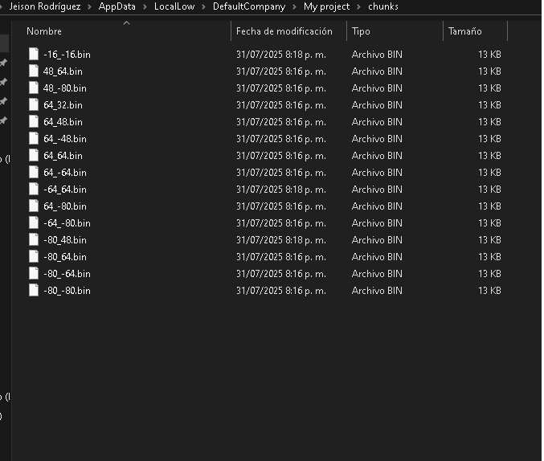
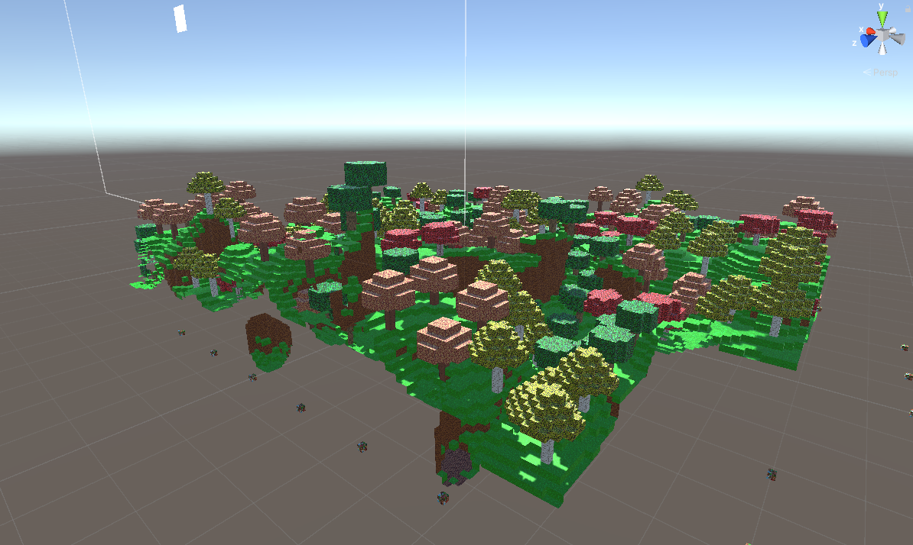

# 🌍 Generacion procedural estilo voxel (Minecraft) 🌍

Proyecto desarrollado en Unity inspirado en la generación procedural de mundos al estilo voxel como *Minecraft*. Utiliza algoritmos de **Perlin Noise** para crear terrenos únicos en cada generacion, esto es una modificacion a otro proyecto (DataMiner): https://github.com/JeisonAlexis/DataMiner-Unity-3D-


## 🛠️ Tecnologías utilizadas

- [Unity](https://unity.com/) (versión recomendada: 2019.4 o superior)
- C# para lógica de juego y control de eventos
- Perlin Noise para generación de mapas

## 📷 **Capturas del juego**

- Generacion procedural
<div align="center">
  
  
</div>

- Direccion de guardado de chunks
<div align="center">
  
</div>

- Sistema de renderizado de mesh optimizado



## ▶️ **Trailer**  

<div align="center">
  <a href="https://youtu.be/tyPDoehDxLA">
    
  </a>

  <br>

  <a href="https://youtu.be/tyPDoehDxLA">
    
  </a>

</div>

## 🚀 Modo de Uso

1. Clona el repositorio:
   ```bash
   git clone https://github.com/JeisonAlexis/Generacion-procedural-Unity-3D.git
   cd Generacion-procedural-Unity-3D
2. Abrir Unity Hub
3. Click en Add
4. Click en open project from disk (Version recomendada de Unity 2019.4)
5. Abrir el proyecto

## 📈📉 Observaciones y/o posibles mejoras

1. Bugs:
   - Al guardar y cargar un chunk no genera correctamente la mesh
2. Mejoras funcionales:
   - Sistema de seleccion, guardado y cargado de mundos

**Autor**
- Jeison Alexis Rodriguez Angarita 🙍‍♂️
- Modificacion del proyecto DataMiner (eliminando la Gamificacion y optimizando la generacion de chunks)
- 2025 📅 
